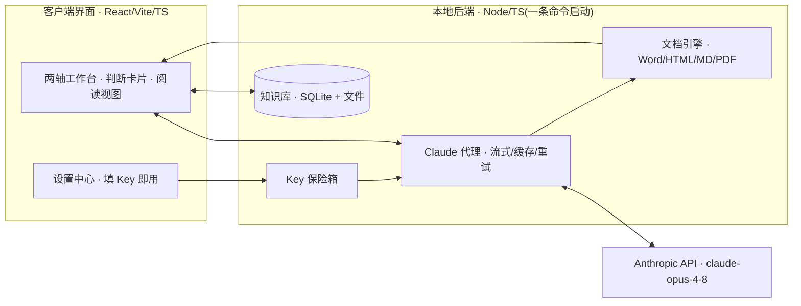

# 业务项目对接工作台 · 开发方案 v1

> 目标：把《业务项目对接工作框架 · 定稿 v1》做成一个可日用的"决策副驾"工作台。
> **填 API Key 即用 · 客户端界面 · 产出 Word/HTML 等多格式 · 以"方便阅读"为第一目标。**

---

## 0. 一句话定位

一个**本地优先(local-first)** 的工作台：以「评估维度 × 时间阶段」两轴组织工作，AI 交出**带立场、带依据、带把握度、带可反驳点**的判断初稿，你在对话中审改；每个项目沉淀出「行业分析 / 企业画像」(半耐用知识库) 与「合作备忘」(易耗交付物)，一键导出 Word / HTML。

工作台不追求"更快出结论"，而追求"更好地开启一轮对话"——这是框架 §0 的红线，也是本方案每个界面的验收标准。

---

## 1. 把「红线原则」翻译成产品规则（最重要的一节）

框架的唯一检验标准：**这功能下判断之后，是想「终结」你的思考，还是「开启」一轮对话？** 落到产品，形成 5 条硬性 UX 规则：

| 规则 | 具体做法 |
|---|---|
| **判断卡片(Judgment Card)统一结构** | 每一处 AI 判断 = `立场/倾向` + `依据` + `把握度(高/中/低 + 为什么)` + `哪几条前提错了这个结论就翻(falsifiers)` + `[反驳] [补充信息] [让它重估]` 三个动作按钮。没有这四段，不算合格输出。 |
| **评估阶段不出分** | 遵循框架 §6，洽谈/评估阶段维度产出的是**问题清单**，不是评分卡。UI 明确不显示打分、不显示星级。评分留到洽谈后信息足够时再议。 |
| **内建反问** | Step 0 定框、行业分析两处，AI 必须主动追问「这框架 / 这份分析，对这个行业可能漏了什么？」——反问是设计出来的功能，不是附赠。 |
| **草稿而非终稿** | 所有 AI 产出默认标注「待审初稿」，可推翻、可回灌新信息让其顺着你的新判断重估。 |
| **主线可视化** | `前提假设 → 问题清单里最高优先级几条 → 洽谈后逐条确认/推翻`，在 UI 里是一条贯穿三阶段、常驻可见的时间线。 |

> 这一节是产品的"灵魂"。技术选型可以换，这 5 条不能松。

---

## 2. 形态与总体架构

**推荐形态：本地优先的「后端 + 网页界面」**——一条命令启动，浏览器即客户端；后续可用 **Tauri** 打包为真正的桌面客户端(.exe / .app)。

### 为什么不用纯浏览器直连？

| 维度 | 纯浏览器直连 | 本地后端(推荐) |
|---|---|---|
| API Key 安全 | 存浏览器 localStorage，需 `anthropic-dangerous-direct-browser-access` 头，Key 暴露在前端 | Key 存本地系统密钥库/加密配置，**不进前端、不入库** |
| Word 质量 | 浏览器端生成，能力受限 | 后端高保真生成，可选 Pandoc + 模板 |
| 知识库 | 只能 IndexedDB，脆弱 | SQLite + 文件，半耐用资产妥善持久化 |
| 流式/缓存/重试 | 受 CORS 与浏览器限制 | 后端统一做流式、Prompt Caching、错误重试 |

半耐用交付物（行业分析、企业画像）是框架明确指出的**复利资产**，值得一个像样的后端来存与复用——这是选"本地后端"而非"纯浏览器"的决定性理由。

### 架构图

---

## 3. 技术选型

| 层 | 选型 | 理由 |
|---|---|---|
| 前端 | React + Vite + TypeScript | 生态成熟；Markdown 渲染 + **Mermaid 内联**；阅读视图/TOC/可折叠推理易实现 |
| 后端 | Node(Fastify) + TypeScript | 与前端同语言，易维护、易 Tauri 打包；官方 Anthropic TS SDK |
| LLM | **claude-opus-4-8**(默认)；行业深度分析可选 **claude-fable-5** 或 `effort=xhigh` | Opus 4.8 为默认强模型；行业分析是最高质量档，允许上更强模型/更高 effort |
| LLM 调用 | 流式 + **Prompt Caching** + adaptive thinking + structured outputs | 长文必须流式；框架文+角色+行业分析作缓存前缀省钱提速；跟踪表/四流用结构化输出 |
| 存储 | SQLite(better-sqlite3) + 本地文件 | 项目区 / 知识库区分离；零外部服务 |
| 导出(默认) | 纯 JS 管线：`docx` 包 + 原生 HTML | **零外部依赖**，贴合"填 Key 即用" |
| 导出(可选) | Pandoc + `reference.docx` 模板 | 需装 Pandoc，换取最高保真 Word/PDF（house style、TOC、CJK） |
| 图 | Mermaid：HTML 内联；Word/PDF 预渲染 SVG/PNG 或降级原生表格 | 交易结构图既要网页活图，也要能进 Word |
| 打包(可选,M4) | Tauri → 真桌面客户端 | 体积小；Node 逻辑作 sidecar 或前移到前端 |

> 备选：若更看重 Word 保真度，后端可换 **Python + FastAPI + python-docx**。代价是双语言、桌面打包更重。本方案默认全 TypeScript，以换取一致性与桌面化路径。

---

## 4. 功能模块（严格对齐框架结构）

### 4.1 设置中心 —— "填 Key 即用"
- API Key、模型、effort、max_tokens、是否流式；**一键连通性自检**。
- **我方角色预设库**：资金方 / 场地资源方 / 货源方 / 运营方 / 牵头整合 / 客户……（Step 0 选角色后据此排维度权重）。
- **行业分析深度基准 & few-shot 范本管理**：可上传《算力租赁行业深度研究与项目评估》作为对齐样板。
- 导出模板（house style / `reference.docx`）。
- Key 存系统密钥库 / 本地加密配置，**不入库、不进前端**。

### 4.2 项目工作区 —— 两轴看板
- 维度(纵) × 阶段(横) 的看板；同一维度三态：**假设 → 验证 → 结论**。
- 主线时间线常驻顶部（前提假设 → 问题 → 确认/推翻）。

### 4.3 Step 0 · 定框
先确认**我方角色** → 轻扫行业垫底 → **AI 提框**（核心层 6 维全量 + 该行业叠加层建议，带理由，按角色排权重）→ 你增删辩驳。内建反问「这框架可能漏了这行业什么？」。框架是**活草稿**，分析中撞见装不下的东西 → 改框，不硬塞。

### 4.4 调研前 · 行业深度分析 + 企业画像
- **行业分析**对齐 6 条验收线：①决策主心骨 ②能劈开行业的分层轴 ③量化区间 + 口径透明 ④点명命门变量 ⑤有名有姓的风险(含强监管红线/真实案例) ⑥角色视角。用 few-shot 锚定深度，产出**「这单成立的前提假设」**。
- **企业画像**：真实诉求/动机、实力与资质、决策链与关键人、**替代选项(=我方筹码)**。
- 二者写入**知识库**（半耐用、可复用、版本化）。

### 4.5 洽谈中 · 评估要点 + 洽谈问题清单
- 维度产出的是**问题**（还没搞清什么、要查什么、要问对方什么），**不出分**。
- 前提假设自动转化为问题清单里**优先级最高**的几条——让洽谈聚焦于"验证那几个能推翻这单的假设"。

### 4.6 洽谈后 · 会议记录 → 合作备忘
- 输入：会议纪要 / 语音转写文本（v1 接受文本；语音转写可 M4 接入）。
- AI 做四件事：①结构化纪要 → ②**映射回维度、尤其映射回前提假设**（逐条标：已确认/已推翻/仍待验证/本次新出现）→ ③可行性**判断初稿**(做/缓/弃倾向 + 理由 + 存疑) → ④画交易结构图收口。
- 输出：一份合并的**合作备忘**（含可行性 + 交易结构图，从简、讲清即可）。这一步**闭合主线**。

### 4.7 交易结构图 & 合规探测器（招牌件）
- **四流**：资金流、货物/服务流、票流、**合同流**。
- Mermaid 生成结构图；**一致性检查**：四流不闭合 / 签约主体·收款主体·发货开票主体对不上 → 红灯（提示虚开、进销不匹配、走单、资金池、变相融资等结构性风险）。
- 定位 = 把合规风险 / 价值分配 / 风险分配收口的一张综合图。

### 4.8 知识库
- 行业分析、企业画像；**版本化、可检索、可复用**（"同一家再来可复用"、"周期更新"）。

### 4.9 导出中心
- **Word / HTML / Markdown / PDF**；阅读优化：CJK 排版与行距、TOC/侧栏导航、内联图、**可折叠推理**、打印 CSS。

---

## 5. LLM 编排

- **模型策略**：默认 `claude-opus-4-8`；行业深度分析这类最高质量档，允许切 `claude-fable-5` 或 `effort=xhigh`。
- **流式**：行业分析、合作备忘等长文一律流式（`get_final_message()` 兜底），避免超时。
- **Prompt Caching**：框架全文 + 我方角色 + 已产出的行业分析 → 作为**稳定前缀缓存**，跨阶段调用省钱提速。
- **structured outputs**：前提假设跟踪表、四流数据用 `output_config.format` 结构化，保证机器可解析、可驱动 UI 与合规检查；散文部分保持自由文本。
- **每阶段提示词共同骨架**：判断初稿(立场+依据+把握度+falsifiers) / 问题而非分数 / 内建反问。
- **few-shot 锚定**：以《算力租赁…》范本对齐"有主张 + 标口径"的行业分析深度。

---

## 6. 导出与阅读体验

- **内部规范格式** = 结构化 Markdown + 元数据（判断卡片、前提假设、四流均带结构化字段）。一次撰写，多路渲染。
- **HTML**：原生样式 + 活 Mermaid + 阅读优化排版。
- **Word**：默认 `docx` 包；可选 Pandoc + `reference.docx` 模板；图预渲染为图片嵌入；显式设定 CJK 字体。
- **PDF**：浏览器打印 / weasyprint / Pandoc（可选）。

---

## 7. 数据模型（概念）

- **项目(Deal)**：我方角色、行业、框架(活草稿)、前提假设[]、各阶段交付物[]、洽谈记录[]。
- **知识库**：行业分析、企业画像（跨项目、版本化、可检索）。
- **存储**：SQLite（结构与索引）+ 本地文件（长文与导出物）。

---

## 8. 里程碑与交付节奏

| 里程碑 | 内容 |
|---|---|
| **M1 · 骨架** | 设置中心(填 Key 即用) + 项目工作区两轴看板 + Step 0 定框 + 导出打通(HTML/Word)。跑通一条端到端。 |
| **M2 · 主干** | 行业深度分析(含 6 条验收线 + few-shot) + 企业画像 + 前提假设；洽谈问题清单。 |
| **M3 · 收口** | 会议记录 → 合作备忘 + 交易结构图/合规探测器；知识库(版本化/复用)。 |
| **M4 · 可选** | Tauri 桌面打包 + Pandoc 高保真导出 + 语音转写接入。 |

---

## 9. 范围与非目标（遵循框架 §6）

- **纳入**：项目洽谈 + 评估方向（框架 §1–§5）。
- **v1 暂不纳入**：立项/分诊 intake、决策—呈报—交接、复盘、评分卡、内部利益相关方地图。

---

## 10. 待你拍板的开放问题

1. **形态**：本地网页(推荐) / 纯浏览器 / 直接桌面客户端(Tauri)？
2. **默认模型**：全程 `claude-opus-4-8`，还是行业分析单独上 `claude-fable-5`？
3. **导出**：是否引入 Pandoc 换高保真 Word/PDF（多一个安装依赖）？
4. **语音转写**：v1 只收文本，还是要接语音转写？
5. **知识库存储**：SQLite（推荐）还是纯文件？

> 拍板后从 **M1 骨架**开始落地：先把"设置中心 + Step 0 定框 + 一次导出"跑成端到端的可用切片。
