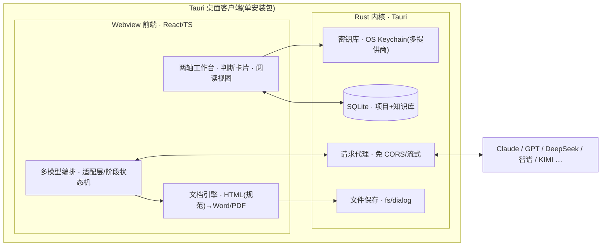

# 战略发展分析工作台 · 开发方案 v2.1（Tauri 桌面客户端 · 多模型）

> 目标：把《业务项目对接工作框架 · 定稿 v1》做成一个可日用的"决策副驾"桌面客户端。
> **填 API Key 即用（多模型）· 真桌面客户端(.exe/.dmg/.AppImage) · 产出 Word/HTML 等多格式 · 以"方便阅读"为第一目标。**
>
> 形态已定：**Tauri 桌面客户端**。第一段 Web 内核已在 `app/` 实现（M1）；第二段 Tauri 封装待出包。
>
> **术语**：「项目」＝待评估的业务合作/投资项目（deal）；「分析 / 研究」＝本工作台对一个项目的一次评估（代码类型 `Analysis`）。

---

## 0. 一句话定位

一个 **Tauri 桌面客户端**：以「评估维度 × 时间阶段」两轴组织工作，AI 交出**带立场、带依据、带把握度、带可反驳点**的判断初稿，你在对话中审改；每个项目沉淀出「行业分析 / 企业画像」(半耐用知识库) 与「合作备忘」(易耗交付物)，一键导出 Word / HTML / PDF。设置里保留 Claude / GPT / DeepSeek / 智谱 / KIMI 等多模型，填 Key 即用。

工作台不追求"更快出结论"，而追求"更好地开启一轮对话"——这是框架 §0 的红线，也是本方案每个界面的验收标准。

---

## 1. 把「红线原则」翻译成产品规则（最重要的一节）

框架的唯一检验标准：**这功能下判断之后，是想「终结」你的思考，还是「开启」一轮对话？** 落到产品，形成 5 条硬性 UX 规则：

| 规则 | 具体做法 |
|---|---|
| **判断卡片(Judgment Card)统一结构** | 每一处 AI 判断 = `立场/倾向` + `依据` + `把握度(高/中/低 + 为什么)` + `哪几条前提错了这个结论就翻(falsifiers)` + `[反驳] [补充信息] [让它重估]`。详见 `详细设计-核心数据结构.md`。 |
| **评估阶段不出分** | 遵循框架 §6，洽谈/评估阶段维度产出的是**问题清单**，不是评分卡。 |
| **内建反问** | Step 0 定框、行业分析两处，AI 必须主动追问「这框架 / 这份分析，对这个行业可能漏了什么？」 |
| **草稿而非终稿** | 所有 AI 产出默认标注「待审初稿」，可推翻、可回灌新信息让其重估。 |
| **主线可视化** | `前提假设 → 问题清单里最高优先级几条 → 洽谈后逐条确认/推翻`，常驻可见的时间线。 |

---

## 2. 形态与总体架构（Tauri）

**Tauri 桌面客户端** = `Rust 内核` + `Webview 前端(React/TS)`。产物是单个安装包，体积小（复用系统 WebView），无需用户装 Node/Python/浏览器插件——**打开、填 Key、即用**。

### 分层职责

| 层 | 负责 | 关键技术 |
|---|---|---|
| **Webview 前端(React/TS)** | 全部 UI；**多模型编排**（适配层、提示词、阶段状态机）；**文档生成**（富样式 HTML / Word / PDF 全在前端完成）；阅读视图 | React + Vite + TS；样例设计系统；`html-to-docx`；Mermaid/SVG |
| **Rust 内核(Tauri 命令/插件)** | 多提供商 Key 保管；请求代理；本地持久化；文件保存 | `tauri-plugin-stronghold`/`keyring`(密钥库)；`tauri-plugin-http`(免 CORS)；`tauri-plugin-sql`(SQLite)；`tauri-plugin-fs`+`dialog` |

### 架构图

### 安全模型（Key 怎么存、模型怎么调）

- **多提供商 API Key 存 OS 密钥库**（Windows 凭据管理器 / macOS Keychain / Linux Secret Service），不写明文配置、不入库。
- **严格 CSP**：只加载打包进 App 的本地资源，禁远程脚本——XSS 面几乎为零。
- **模型调用**：前端**适配层**统一接口，HTTP 走 `tauri-plugin-http`（绕过 CORS）。Claude 走 Anthropic SDK（拿到缓存/结构化/adaptive 全能力）；GPT/DeepSeek/智谱/KIMI 走 OpenAI 兼容端点（能力降级到通用子集）。Key 仅在调用时从密钥库读入内存。→ 详见 `详细设计-多模型适配与导出模板.md`。
- **更严隔离（备选）**：把请求整体放进 Rust，Key 全程不进 Webview，流式经 channel 回传。代价：多提供商都要在 Rust 重写，开发量更大。→ 见 §8。

---

## 3. 技术选型

| 层 | 选型 | 理由 |
|---|---|---|
| 壳 | **Tauri 2.x** | 真桌面客户端；安装包小；系统 WebView；Rust 侧安全边界清晰 |
| 前端 | React + Vite + TypeScript | 阅读视图/TOC/可折叠推理；复用样例设计系统 |
| LLM(多模型) | **多提供商适配**：Claude / GPT / DeepSeek / 智谱GLM / KIMI…，默认 **claude-opus-4-8**（行业分析可选 `claude-fable-5`） | 保留多模型 Key、可按阶段选模型；Claude 独有能力优雅降级到通用子集 |
| LLM 调用 | 适配层 + `tauri-plugin-http`；流式 + 结构化输出（Claude `output_config.format` / 其余 JSON mode+校验重试） | 免 CORS；长文流式；硬结构化步骤默认用 Claude 更稳 |
| 存储 | **SQLite**(`tauri-plugin-sql`) + 本地文件 | 项目区/知识库区；零外部服务 |
| **规范格式** | **富样式 HTML**（采用参考样例设计系统，见 `docs/参考样例/`） | HTML 即规范交付格式、阅读优先；LLM 直接产出该组件库 |
| Word 导出 | **HTML → DOCX**（前端 `html-to-docx` 类库） | 复用 HTML 设计，避免逐节手搭 docx；复杂图降级为图片/表格 |
| PDF 导出 | WebView 打印（样例已内置 A4 `@page`/`@media print`） | 无需外部二进制，打印级排版 |
| 图 | 交易结构图 SVG/Mermaid 网页内联；Word/PDF 光栅化为 PNG 嵌入 | 既要活图也要能进 Word，全前端完成 |

> 备选：Word 保真度不够时，可后置引入 **Pandoc**（HTML/Markdown → DOCX，多一个安装依赖）。默认走前端 HTML→DOCX，贴合"填 Key 即用"。

---

## 4. 功能模块（严格对齐框架结构）

### 4.1 设置中心 —— "填 Key 即用（多模型）"
- **多模型 API Key**（Claude / GPT / DeepSeek / 智谱GLM / KIMI… 可扩展）：每个提供商配 `密钥 / base_url / 模型列表`；**逐提供商一键连通性自检**。
- **按阶段选模型**：Step0 / 行业分析 / 画像 / 问题清单 / 洽谈后 可各自指定"提供商+模型"，默认全 Claude。
- **我方角色预设库**：资金方 / 场地资源方 / 货源方 / 运营方 / 牵头整合 / 客户……
- **行业分析深度基准 & few-shot 范本**：内置样例《算力租赁·深度研究与项目评估》作对齐样板。
- Key 存 OS 密钥库，不入库、不进前端持久层。

### 4.2 项目工作区 —— 两轴看板
维度(纵) × 阶段(横)；同一维度三态：**假设 → 验证 → 结论**。主线时间线常驻。

### 4.3 Step 0 · 定框
先确认**我方角色** → 轻扫行业 → AI 提框（核心 6 维 + 该行业叠加层，带理由、按角色排权重）→ 你增删辩驳。内建反问「这框架可能漏了什么？」。框架是**活草稿**。

### 4.4 调研前 · 行业深度分析 + 企业画像
- 行业分析对齐 6 条验收线，用样例 few-shot 锚定深度，**直接产出样例同款的富样式 HTML**；产出「前提假设」。→ `详细设计-行业分析提示词.md`、`详细设计-多模型适配与导出模板.md`。
- 企业画像：诉求、实力资质、决策链关键人、替代选项(=我方筹码)。
- 二者写入**知识库**（半耐用、版本化、可复用）。→ `详细设计-核心数据结构.md`。

### 4.5 洽谈中 · 评估要点 + 洽谈问题清单
维度产出**问题**，不出分；前提假设自动转化为最高优先级问题。

### 4.6 洽谈后 · 会议记录 → 合作备忘
会议记录 → ①结构化纪要 → ②映射回维度与前提假设 → ③可行性判断初稿 → ④交易结构图收口，输出合并合作备忘，闭合主线。

### 4.7 交易结构图 & 合规探测器（招牌件）
四流（资金/货物服务/票/合同）→ 图 + **确定性合规规则**红灯（复用样例的 SVG diagram + 危险信号清单 + 结论盒）。→ `详细设计-交易结构图与合规规则.md`。

### 4.8 知识库
行业分析、企业画像；版本化、可检索、可复用。

### 4.9 导出中心
HTML(规范) / Word / PDF；阅读优化沿用样例设计系统（CJK 排版、TOC、内联图、A4 打印）。

---

## 5. 详细设计文档索引

| 文档 | 内容 |
|---|---|
| `详细设计-核心数据结构.md` | 判断卡片、前提假设跟踪表、问题、项目/框架、知识库实体、SQLite schema、主线机制 |
| `详细设计-交易结构图与合规规则.md` | 四流数据模型、生成、**确定性合规规则集 R1–R7**、AI 与规则的分工 |
| `详细设计-行业分析提示词.md` | 通用判断卡片契约 + 各阶段提示词骨架 + 行业分析 6 线对齐 + few-shot + 模型参数 |
| `详细设计-多模型适配与导出模板.md` | 多提供商适配与能力降级；富样式 HTML 导出模板（参考样例组件库）；HTML→Word/PDF |
| `参考样例/算力租赁-行业深度分析-样例.html` | 你上传的样例：既是行业分析 few-shot 范本，也是导出设计系统模板 |

---

## 6. 里程碑与交付节奏

| 里程碑 | 内容 |
|---|---|
| **M0 · 详设**（当前） | 本方案 + 四份专项详设 + 参考样例入库，确认后再编码 |
| **M1 · 骨架** | Tauri 脚手架 + 设置中心(多模型填 Key 即用/密钥库/连通性自检) + 两轴看板 + Step 0 定框 + 导出打通(HTML/Word/PDF)。跑通端到端 |
| **M2 · 主干** | 行业深度分析(6 线 + 样例模板) + 企业画像 + 前提假设；洽谈问题清单 |
| **M3 · 收口** | 会议记录 → 合作备忘 + 交易结构图/合规探测器；知识库(版本化/复用) |
| **M4 · 打磨** | 打包分发(.msi/.dmg/.AppImage) + 阅读体验优化 + （可选）Pandoc 高保真 / 语音转写 |

---

## 7. 范围与非目标（遵循框架 §6）

- **纳入**：项目洽谈 + 评估方向（框架 §1–§5）。
- **v1 暂不纳入**：立项/分诊 intake、决策—呈报—交接、复盘、评分卡、内部利益相关方地图。

---

## 8. 决策进展与待办（形态已定为 Tauri）

**已定：**
- **多模型适配**：保留 Claude / GPT / DeepSeek / 智谱 / KIMI… 多提供商 Key，默认 Claude，可按阶段选模型。
- **Word 引擎**：走 **HTML → DOCX**（富样式 HTML 为规范格式，采用上传样例的设计系统），不用纯 docx 手搭。
- **语音转写**：v1 只收文本，语音转写留 M4。
- **few-shot 范本**：已由上传的《算力租赁·深度研究与项目评估》HTML 提供（既是行业分析深度样板，也是导出模板），已入库 `docs/参考样例/`。

**待你确认：**
1. **调用位置**：前端适配层 + tauri-http（推荐，多模型都好接、功能全）／ 全放 Rust（Key 更隔离、开发量大）？
2. **是否开工 M1**：设置中心(多模型填 Key 即用) + Step 0 定框 + 一次导出(HTML/Word/PDF) 端到端切片。

> 确认后即从 **M1** 落地。
