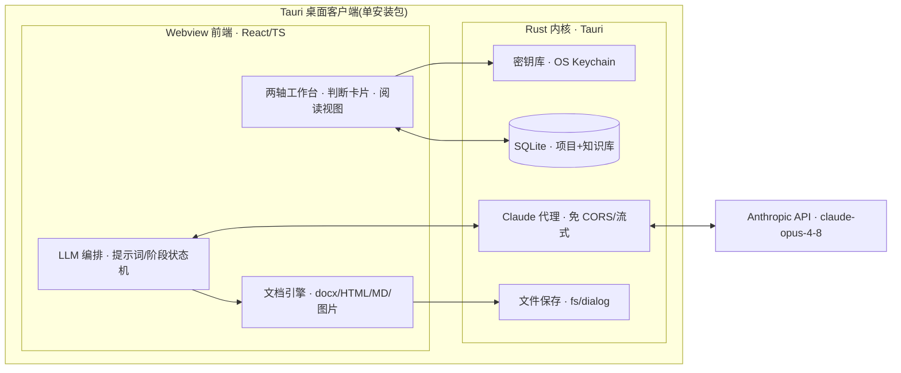

# 业务项目对接工作台 · 开发方案 v2（Tauri 桌面客户端）

> 目标：把《业务项目对接工作框架 · 定稿 v1》做成一个可日用的"决策副驾"桌面客户端。
> **填 API Key 即用 · 真桌面客户端(.exe/.dmg/.AppImage) · 产出 Word/HTML 等多格式 · 以"方便阅读"为第一目标。**
>
> 形态已定：**Tauri 桌面客户端**。本轮先细化方案，暂不编码。

---

## 0. 一句话定位

一个 **Tauri 桌面客户端**：以「评估维度 × 时间阶段」两轴组织工作，AI 交出**带立场、带依据、带把握度、带可反驳点**的判断初稿，你在对话中审改；每个项目沉淀出「行业分析 / 企业画像」(半耐用知识库) 与「合作备忘」(易耗交付物)，一键导出 Word / HTML。

工作台不追求"更快出结论"，而追求"更好地开启一轮对话"——这是框架 §0 的红线，也是本方案每个界面的验收标准。

---

## 1. 把「红线原则」翻译成产品规则（最重要的一节）

框架的唯一检验标准：**这功能下判断之后，是想「终结」你的思考，还是「开启」一轮对话？** 落到产品，形成 5 条硬性 UX 规则：

| 规则 | 具体做法 |
|---|---|
| **判断卡片(Judgment Card)统一结构** | 每一处 AI 判断 = `立场/倾向` + `依据` + `把握度(高/中/低 + 为什么)` + `哪几条前提错了这个结论就翻(falsifiers)` + `[反驳] [补充信息] [让它重估]`。没有这四段，不算合格输出。详见 `详细设计-核心数据结构.md`。 |
| **评估阶段不出分** | 遵循框架 §6，洽谈/评估阶段维度产出的是**问题清单**，不是评分卡。UI 明确不显示打分。 |
| **内建反问** | Step 0 定框、行业分析两处，AI 必须主动追问「这框架 / 这份分析，对这个行业可能漏了什么？」 |
| **草稿而非终稿** | 所有 AI 产出默认标注「待审初稿」，可推翻、可回灌新信息让其重估。 |
| **主线可视化** | `前提假设 → 问题清单里最高优先级几条 → 洽谈后逐条确认/推翻`，在 UI 里是一条贯穿三阶段、常驻可见的时间线。 |

---

## 2. 形态与总体架构（Tauri）

**Tauri 桌面客户端** = `Rust 内核` + `Webview 前端(React/TS)`。产物是单个安装包，体积小（复用系统 WebView），无需用户装 Node/Python/浏览器插件——**打开、填 Key、即用**。

### 分层职责

| 层 | 负责 | 关键技术 |
|---|---|---|
| **Webview 前端(React/TS)** | 全部 UI；LLM 编排（提示词组装、阶段状态机）；**文档生成**（.docx / HTML / Markdown / 图片全在前端完成）；阅读视图 + Mermaid 内联 | React + Vite + TypeScript；`docx`(生成 Word)；Mermaid(渲染+导出 SVG/PNG) |
| **Rust 内核(Tauri 命令/插件)** | API Key 保管；Claude 请求代理；本地持久化；文件保存 | `tauri-plugin-stronghold` 或 `keyring`(密钥库)；`tauri-plugin-http`(直连 Claude、免 CORS)；`tauri-plugin-sql`(SQLite)；`tauri-plugin-fs` + `tauri-plugin-dialog`(导出保存) |

### 架构图

### 安全模型（Key 怎么存、Claude 怎么调）

- **API Key 存 OS 密钥库**（Windows 凭据管理器 / macOS Keychain / Linux Secret Service），不写明文配置、不入库。
- **严格 CSP**：只加载打包进 App 的本地资源，禁远程脚本——XSS 面几乎为零，风险画像接近原生应用。
- **Claude 调用（推荐默认）**：前端用 Anthropic **TS SDK**，其 `fetch` 走 `tauri-plugin-http`（绕过浏览器 CORS），Key 仅在调用时从密钥库读入内存。既拿到 SDK 全部能力（流式、Prompt Caching、structured outputs、tool use），桌面环境下"Key 在内存"的风险可接受。
- **更严隔离（备选）**：把整个 Claude 请求放进 Rust（`reqwest` + SSE），Key 全程不进 Webview，流式经 Tauri channel 回传。代价：需在 Rust 手写请求/缓存/结构化输出，开发量更大。→ 见 §10 待拍板。

---

## 3. 技术选型

| 层 | 选型 | 理由 |
|---|---|---|
| 壳 | **Tauri 2.x** | 真桌面客户端；安装包小；系统 WebView；Rust 侧安全边界清晰 |
| 前端 | React + Vite + TypeScript | Markdown 渲染 + Mermaid 内联；阅读视图/TOC/可折叠推理 |
| LLM | **claude-opus-4-8**(默认)；行业深度分析可选 **claude-fable-5** 或 `effort=xhigh` | Opus 4.8 为默认强模型；行业分析是最高质量档 |
| LLM 调用 | Anthropic **TS SDK** + `tauri-plugin-http`；流式 + Prompt Caching + adaptive thinking + structured outputs | 免 CORS；长文流式；框架/角色/行业分析作缓存前缀；跟踪表/四流用结构化输出 |
| 存储 | **SQLite**(`tauri-plugin-sql`) + 本地文件 | 项目区/知识库区；零外部服务 |
| Word 导出 | **`docx`** npm 包（前端生成 .docx Blob → dialog 保存） | 零外部依赖，桌面内自足 |
| HTML/MD 导出 | 原生序列化阅读视图 | 活 Mermaid、阅读优化排版 |
| 图 | Mermaid：网页内联；Word/PDF 前端渲染为 SVG/PNG 嵌入 | 交易结构图既要活图也要能进 Word，全前端完成 |
| PDF(可选) | WebView 打印为 PDF / 前端库 | 无需外部二进制 |

> 备选：若要最高保真 Word/PDF（house style、复杂 TOC），可后置引入 **Pandoc**（多一个安装依赖）。默认走纯前端 `docx`，贴合"填 Key 即用"。

---

## 4. 功能模块（严格对齐框架结构）

### 4.1 设置中心 —— "填 Key 即用"
- API Key、模型、effort、max_tokens、是否流式；**一键连通性自检**。
- **我方角色预设库**：资金方 / 场地资源方 / 货源方 / 运营方 / 牵头整合 / 客户……
- **行业分析深度基准 & few-shot 范本管理**：可上传《算力租赁行业深度研究与项目评估》作为对齐样板。
- 导出模板（house style）。
- Key 存 OS 密钥库，不入库、不进前端持久层。

### 4.2 项目工作区 —— 两轴看板
维度(纵) × 阶段(横) 的看板；同一维度三态：**假设 → 验证 → 结论**。主线时间线常驻。

### 4.3 Step 0 · 定框
先确认**我方角色** → 轻扫行业 → **AI 提框**（核心 6 维全量 + 该行业叠加层建议，带理由，按角色排权重）→ 你增删辩驳。内建反问「这框架可能漏了这行业什么？」。框架是**活草稿**，撞见装不下的东西 → 改框，不硬塞。

### 4.4 调研前 · 行业深度分析 + 企业画像
- **行业分析**对齐 6 条验收线；用 few-shot 锚定深度；产出**「这单成立的前提假设」**。→ 详见 `详细设计-行业分析提示词.md`。
- **企业画像**：真实诉求、实力资质、决策链关键人、**替代选项(=我方筹码)**。
- 二者写入**知识库**（半耐用、版本化、可复用）。→ 详见 `详细设计-核心数据结构.md`。

### 4.5 洽谈中 · 评估要点 + 洽谈问题清单
维度产出**问题**（还没搞清什么、要查什么、要问对方什么），**不出分**；前提假设自动转化为问题清单里优先级最高的几条。

### 4.6 洽谈后 · 会议记录 → 合作备忘
输入会议纪要/语音转写文本 → AI：①结构化纪要 → ②**映射回维度与前提假设**（已确认/已推翻/仍待验证/本次新出现）→ ③可行性**判断初稿** → ④画交易结构图收口。输出合并的合作备忘，闭合主线。

### 4.7 交易结构图 & 合规探测器（招牌件）
四流（资金/货物服务/票/**合同**）→ Mermaid 结构图 + **确定性合规规则**红灯检测。→ 详见 `详细设计-交易结构图与合规规则.md`。

### 4.8 知识库
行业分析、企业画像；版本化、可检索、可复用。→ 详见 `详细设计-核心数据结构.md`。

### 4.9 导出中心
Word / HTML / Markdown / PDF；阅读优化：CJK 排版、TOC、内联图、可折叠推理、打印 CSS。

---

## 5. 详细设计文档索引

| 文档 | 内容 |
|---|---|
| `详细设计-核心数据结构.md` | 判断卡片、前提假设跟踪表、问题、项目/框架、知识库实体、SQLite schema、主线机制 |
| `详细设计-交易结构图与合规规则.md` | 四流数据模型、Mermaid 生成、**确定性合规规则集**、AI 与规则的分工 |
| `详细设计-行业分析提示词.md` | 通用判断卡片契约 + 各阶段提示词骨架 + 行业分析 6 线对齐 + few-shot + 反问 + 模型参数 |

---

## 6. 里程碑与交付节奏

| 里程碑 | 内容 |
|---|---|
| **M0 · 详设**（当前） | 本方案 + 三份专项详设，确认后再编码 |
| **M1 · 骨架** | Tauri 脚手架 + 设置中心(填 Key 即用/密钥库/连通性自检) + 项目工作区两轴看板 + Step 0 定框 + 导出打通(HTML/Word)。跑通一条端到端 |
| **M2 · 主干** | 行业深度分析(6 线 + few-shot) + 企业画像 + 前提假设；洽谈问题清单 |
| **M3 · 收口** | 会议记录 → 合作备忘 + 交易结构图/合规探测器；知识库(版本化/复用) |
| **M4 · 打磨** | 打包分发(.msi/.dmg/.AppImage) + 阅读体验优化 + （可选）Pandoc 高保真 / 语音转写 |

---

## 7. 范围与非目标（遵循框架 §6）

- **纳入**：项目洽谈 + 评估方向（框架 §1–§5）。
- **v1 暂不纳入**：立项/分诊 intake、决策—呈报—交接、复盘、评分卡、内部利益相关方地图。

---

## 8. 待你拍板的开放问题（形态已定为 Tauri）

1. **Claude 调用位置**：前端 TS SDK + tauri-http（推荐，开发快、功能全）／ 全放 Rust（Key 更隔离、开发量大）？
2. **默认模型**：全程 `claude-opus-4-8`，还是行业分析单独上 `claude-fable-5`？
3. **Word 引擎**：纯前端 `docx` 包（推荐，零依赖）／ 后置引入 Pandoc 换高保真？
4. **语音转写**：v1 只收文本，还是要接语音转写？
5. **few-shot 范本**：能否提供《算力租赁行业深度研究与项目评估》作为行业分析对齐样板？

> 三份详设确认后，从 **M1 骨架**开始落地：先把"设置中心 + Step 0 定框 + 一次导出"跑成端到端可用切片。
