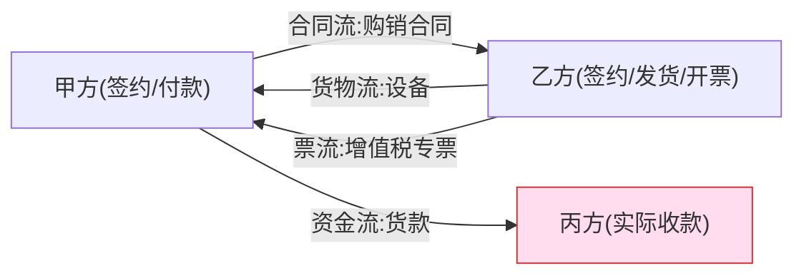
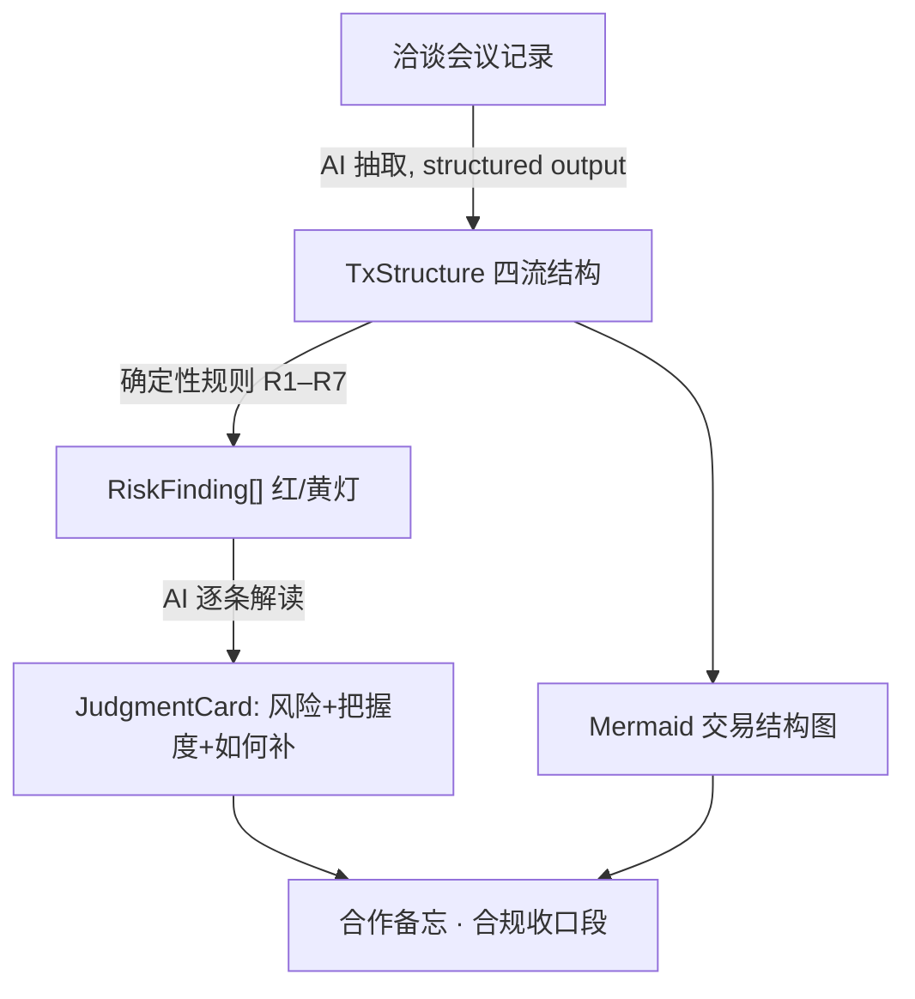

# 详细设计 · 交易结构图与合规规则（招牌件）

> 框架 §4 的收口件：**四流**（资金流、货物/服务流、票流、合同流）画成一张图，并作为**合规风险探测器**。
> 关键设计：**AI 负责从会议记录抽结构，确定性规则负责报红灯，AI 再就红灯给判断卡片**——红灯判定不靠 AI 自由发挥，靠可复核的硬规则。

---

## 1. 四流数据模型

```ts
interface Party {
  id: string;
  name: string;
  roles: PartyRole[];            // 同一主体可担多个角色（对不上时正是风险点）
}
type PartyRole =
  | "签约主体" | "收款主体" | "付款主体"
  | "发货/服务提供" | "收货/服务接收" | "开票方" | "受票方"
  | "非交易第三方";               // 走单/代收代付里冒出来的第三方

type FlowType = "资金流" | "货物服务流" | "票流" | "合同流";

interface Flow {
  id: string;
  type: FlowType;
  from: string;                  // Party.id
  to: string;                    // Party.id
  instrument?: string;          // 合同名/发票种类/支付方式/货物名
  amount?: number;
  note?: string;
}

interface TxStructure {
  projectId: string;
  parties: Party[];
  flows: Flow[];
  timing?: { lockPeriod?: string; lockPrice?: string };  // 时点/周期透镜（框架 §2.4）
}
```

- **合同流是新增的第 4 流**，也是最关键的一条：只看资金/货物/票三流时，签约主体 ≠ 收款/发货开票主体的"名实分离"看不出来，叠上合同流即露馅。

---

## 2. Mermaid 生成规则

四种流用不同线型/颜色，主体为节点。前端由 `TxStructure` 生成 Mermaid，网页内联渲染；导出 Word/PDF 时前端把 SVG 光栅化为 PNG 嵌入。



> 上图即一个典型红灯：签约/发货/开票是乙方 B，但资金流向丙方 C（收款主体≠签约主体）——代收代付/名实分离，虚开与资金流向风险。

---

## 3. 确定性合规规则集（核心）

规则**可代码判定、可复核**；命中即红灯，AI 只负责解读与补救建议，不负责"判不判红"。

| 编号 | 规则 | 触发条件（确定性） | 风险提示 |
|---|---|---|---|
| R1 | **四流闭合** | 存在主体收到资金，但无指向它的货物流/服务流与合同流对应 | 资金空转 / 走单红灯 |
| R2 | **签约=收款** | `签约主体` 集合 ≠ `收款主体` 集合 | 代收代付、名实分离；虚开风险 |
| R3 | **签约=发货开票** | `签约主体` ≠ `发货/服务提供` 或 ≠ `开票方` | 走单 / 名义与实际主体分离 |
| R4 | **进销匹配** | 票流方向与货物/服务流方向不一致（有票无货 / 有货无票） | 进销不匹配、虚开 |
| R5 | **资金路径洁净** | 资金流经过 `非交易第三方` 或出现池化归集 | 资金池 / 变相融资 / 支付牌照缺失 |
| R6 | **三流 vs 四流** | 仅资金+货物+票三流看似闭合，但叠加合同流后主体错位 | 合同流露馅——名实分离 |
| R7 | **时点/周期** | `lockPeriod`/`lockPrice` 与市场周期背离（需人工/AI 标注区间） | 时点风险（在什么周期、什么价位锁的） |

实现要点：
- R1–R6 是**图上的集合/路径判定**，纯代码可算，结果稳定可复核。
- R7 需要行业周期区间输入（来自行业分析的量化区间），半自动。
- 每条命中规则 → 生成一个 `RiskFinding`：

```ts
interface RiskFinding {
  rule: "R1"|"R2"|"R3"|"R4"|"R5"|"R6"|"R7";
  level: "红" | "黄";
  parties: string[];             // 涉及主体
  deterministicReason: string;   // 规则判定依据（代码给出，可复核）
  aiInterpretation?: JudgmentCard; // AI 解读：为什么危险、真实案例、如何补救（带把握度）
}
```

---

## 4. AI 与确定性规则的分工



- **AI 抽结构**：从会议记录抽出 parties/flows（`output_config.format` 结构化输出，保证机器可解析）。抽取本身也带把握度——不确定的边标"存疑"，交你确认。
- **规则报红灯**：R1–R7 在结构上跑，红灯判定与 AI 无关，可复核、可回归测试。
- **AI 解读红灯**：每个红灯给判断卡片（为什么危险、有名有姓的案例、如何补救），供你辩驳。
- 收口：交易结构图 + 红灯解读进合作备忘，把**合规风险 / 价值分配 / 风险分配**三个维度收在一张图上——也贴合公司"治理体系建设"的语言。

---

## 5. 交互与阅读

- 图上红灯主体高亮（`classDef warn`），点击展开对应 `RiskFinding` 判断卡片。
- 你可手工增删边/主体（AI 抽错时纠正）→ 规则实时重算红灯。
- 导出：Word/PDF 里图为 PNG + 一张"红灯清单表"（规则/主体/风险/把握度/补救），方便阅读与留档。
